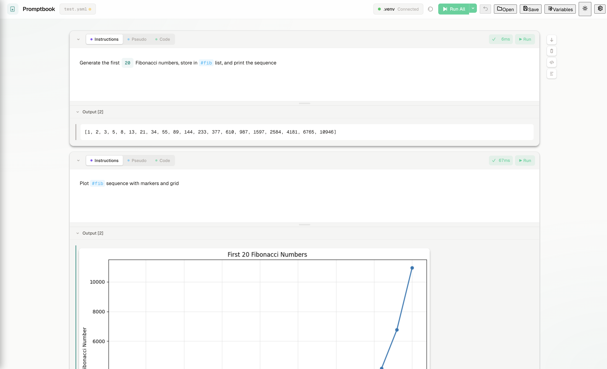

# Promptbook Desktop

Electron-based desktop application for AI-powered notebook development.



## Features

### Project Management

Organize notebooks in projects with a floating file browser:

```
┌──────────────────────────────────────────────────────────────────────────────────┐
│  ☰  Promptbook            ● idle (.venv)   ▶ Run All   Open   Save   Settings    │
├──────────────────────────────────────────────────────────────────────────────────┤
│                                                                                  │
│ ┌────────────────────────────────────────────────────────────────────────────┐   │
│ │  📁 my-project ▼                                                     ✕     │   │
│ ├────────────────────────────────────────────────────────────────────────────┤   │
│ │   📁 data                                                                  │   │
│ │   │  └─ 📄 train.csv                                                       │   │
│ │   │  └─ 📄 test.csv                                                        │   │
│ │   📁 notebooks                                                             │   │
│ │   │  └─ 📓 analysis.yaml        ←── active                                 │   │
│ │   │  └─ 📓 preprocessing.yaml                                              │   │
│ │   │  └─ 📓 model.yaml                                                      │   │
│ │   📄 README.md                                                             │   │
│ │   📄 requirements.txt                                                      │   │
│ └────────────────────────────────────────────────────────────────────────────┘   │
│                                                                                  │
│ ┌────────────────────────────────────────────────────────────────────────────┐   │
│ │  [1]  Load and preprocess training data                          ✓ 0.2s   │   │
│ │ ─────────────────────────────────────────────────────────────────────────  │   │
│ │  df = pd.read_csv('data/train.csv')                                        │   │
│ │  df = df.dropna()                                                          │   │
│ │  print(f"Loaded {len(df)} rows")                                           │   │
│ │ ─────────────────────────────────────────────────────────────────────────  │   │
│ │  Loaded 10000 rows                                                         │   │
│ └────────────────────────────────────────────────────────────────────────────┘   │
│                                                                                  │
│  + Add Cell                                                                      │
└──────────────────────────────────────────────────────────────────────────────────┘
```

### Notebook with Code and Rich Outputs

Three-way sync between descriptions and code, with inline charts:

```
┌──────────────────────────────────────────────────────────────────────────────────┐
│  ☰  Promptbook            ● busy (.venv)   ▶ Run All   📊 Variables   Settings   │
├──────────────────────────────────────────────────────────────────────────────────┤
│                                                                                  │
│ ┌─[ Cell 1 ]────────────────────────────────────────────────────── ▶ ✓ 0.3s ──┐ │
│ │  [ Brief ]  [ Detailed ]  [ Code ]                                          │ │
│ │ ──────────────────────────────────────────────────────────────────────────  │ │
│ │  import pandas as pd                                                        │ │
│ │  import matplotlib.pyplot as plt                                            │ │
│ │  df = pd.read_csv('sales_data.csv')                                         │ │
│ └─────────────────────────────────────────────────────────────────────────────┘ │
│                                                                                  │
│ ┌─[ Cell 2 ]────────────────────────────────────────────────────── ▶ ✓ 1.2s ──┐ │
│ │  [ Brief ]  [ Detailed ]  [ Code ]                                          │ │
│ │ ──────────────────────────────────────────────────────────────────────────  │ │
│ │  Plot monthly sales trend as a line chart with {{color:blue}} line          │ │
│ │ ──────────────────────────────────────────────────────────────────────────  │ │
│ │  plt.figure(figsize=(10, 6))                                                │ │
│ │  plt.plot(df['month'], df['sales'], color='blue', linewidth=2)              │ │
│ │  plt.title('Monthly Sales Trend')                                           │ │
│ │  plt.xlabel('Month')                                                        │ │
│ │  plt.ylabel('Sales ($)')                                                    │ │
│ │  plt.show()                                                                 │ │
│ │ ──────────────────────────────────────────────────────────────────────────  │ │
│ │  Output:                                                                    │ │
│ │  ┌──────────────────────────────────────────────────────────────────────┐  │ │
│ │  │         Monthly Sales Trend                                         │  │ │
│ │  │  $50k │                               ╭─────╮                        │  │ │
│ │  │       │                          ╭────╯     │                        │  │ │
│ │  │  $40k │                     ╭────╯          │                        │  │ │
│ │  │       │                ╭────╯               ╰────╮                   │  │ │
│ │  │  $30k │           ╭────╯                         ╰────╮              │  │ │
│ │  │       │      ╭────╯                                   ╰────╮         │  │ │
│ │  │  $20k │ ╭────╯                                             ╰────     │  │ │
│ │  │       │─────┼─────┼─────┼─────┼─────┼─────┼─────┼─────┼─────┼─────│  │ │
│ │  │       │ Jan  Feb  Mar  Apr  May  Jun  Jul  Aug  Sep  Oct  Nov  Dec│  │ │
│ │  └──────────────────────────────────────────────────────────────────────┘  │ │
│ └─────────────────────────────────────────────────────────────────────────────┘ │
│                                                                                  │
│ ┌─[ Cell 3 ]────────────────────────────────────────────────────── ▶ ✓ 0.8s ──┐ │
│ │  [ Brief ]  [ Detailed ]  [ Code ]                                          │ │
│ │ ──────────────────────────────────────────────────────────────────────────  │ │
│ │  Show top {{n:5}} products by revenue as a bar chart                        │ │
│ │ ──────────────────────────────────────────────────────────────────────────  │ │
│ │  Output:                                                                    │ │
│ │  ┌──────────────────────────────────────────────────────────────────────┐  │ │
│ │  │         Top 5 Products by Revenue                                   │  │ │
│ │  │                                                                     │  │ │
│ │  │  Product A │████████████████████████████████████████│ $125k         │  │ │
│ │  │  Product B │██████████████████████████████│ $98k                    │  │ │
│ │  │  Product C │████████████████████████│ $76k                          │  │ │
│ │  │  Product D │██████████████████│ $54k                                │  │ │
│ │  │  Product E │██████████████│ $42k                                    │  │ │
│ │  │                                                                     │  │ │
│ │  └──────────────────────────────────────────────────────────────────────┘  │ │
│ └─────────────────────────────────────────────────────────────────────────────┘ │
│                                                                                  │
│  + Add Cell                                                                      │
└──────────────────────────────────────────────────────────────────────────────────┘
```

**Key Features:**
- **Three-way sync**: Edit description (Brief/Detailed) or Code - AI keeps them in sync
- **Parameters**: Use `{{name:value}}` in descriptions, change value and code auto-updates
- **Rich outputs**: Matplotlib plots, pandas DataFrames, images render inline
- **Kernel status**: Green (idle), Yellow (busy), Red (disconnected)

### Missing Package Detection

When code execution fails due to a missing Python module, Promptbook automatically detects the error and offers installation options:

```
┌─────────────────────────────────────────────────────────┐
│  Missing Python Packages                            ✕   │
├─────────────────────────────────────────────────────────┤
│                                                         │
│  The following packages are required but not installed: │
│                                                         │
│  Import Name          Package Name                      │
│  ─────────────────────────────────────────────────      │
│  cv2             →    [ opencv-python     ]             │
│  PIL             →    [ pillow            ]             │
│  sklearn         →    [ scikit-learn      ]             │
│                                                         │
│  ─────────────────────────────────────────────────────  │
│                                                         │
│  ┌──────────────┐  ┌────────────────┐  ┌─────────────┐  │
│  │ Install Once │  │ Add to This    │  │ Add to      │  │
│  │              │  │ Cell           │  │ Setup Cell  │  │
│  └──────────────┘  └────────────────┘  └─────────────┘  │
│                                                         │
└─────────────────────────────────────────────────────────┘
```

**Install Options:**
- **Install Once** - Run `pip install` in the kernel session (temporary)
- **Add to This Cell** - Prepend `!pip install` to the current cell
- **Add to Setup Cell** - Add to cell 0 or an existing cell with pip installs

Package names are automatically mapped (e.g., `cv2` → `opencv-python`) and can be edited before installation.

### Shell Commands & IPython Magic

Full IPython support via ipykernel:

```python
# Shell commands (prefix with !)
!pip install pandas
!ls -la
!echo "Hello from shell"

# Capture output to variable
files = !ls *.py

# IPython magics
%pip install numpy    # Recommended for package installation
%timeit sum(range(1000))
%who                  # List variables
%reset                # Clear namespace

# Cell magics
%%time
slow_operation()
```

## Development

```bash
# Install dependencies
pnpm install

# Start development server
pnpm dev

# Build for production
pnpm build
```

## Requirements

- Node.js 18+
- Python 3.8+ (for kernel features)
